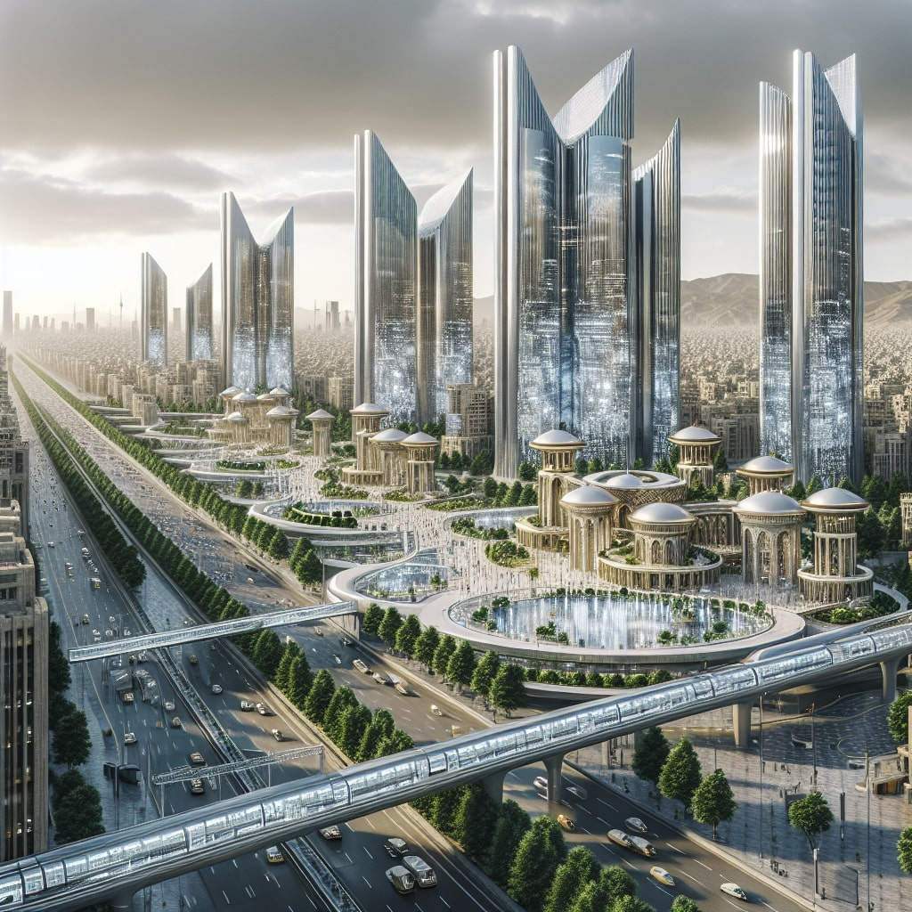

# AI-Generated Photo Gallery

Welcome to our gallery of AI-generated photos! Each image below was created using OpenAI's API through Python using the DALLE-3 Model. 
Take a look at the stunning visuals along with the prompts that inspired their generation.

## Photo 1: Dancing Persian Woman

**Prompt:** *A pop art of a Traditional Persian woman, dancing in a night club on the Moon with a mixed population of futuristic humans and aliens.*

---

## Photo 2: Futuristic Tehran

**Prompt:** *A hyperrealistic longshot image of a futuristic Tehran city, Iran. Featuring modern buildings and architecture.*

---

## Photo 3: Dystopian Society

**Prompt:** *An abstract painting of a crowd of emotionless people, staring at their cellphones and walking around the city, an atmospheric and colorless environment.*

---

## Photo 4: Depression

**Prompt:** *a painting of a depressed person in his dimly lit room, struggling with his dark thoughts, surrealist style.*

---

## Photo 5: Monarchs

**Prompt:** *a conceptual art featuring Iranian past monarchs gathered together in an enigmatic and futuristic environment.*

---

Feel free to explore and appreciate the artistic outcomes of these AI-generated images.
Each image is a unique creation inspired by the prompts provided to the artificial intelligence model.
